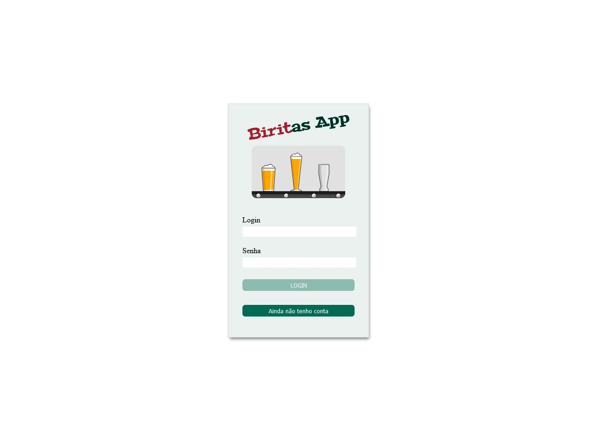
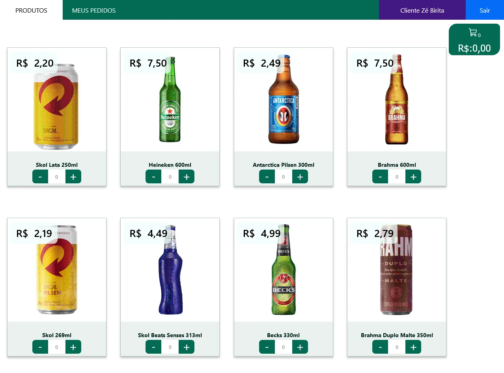
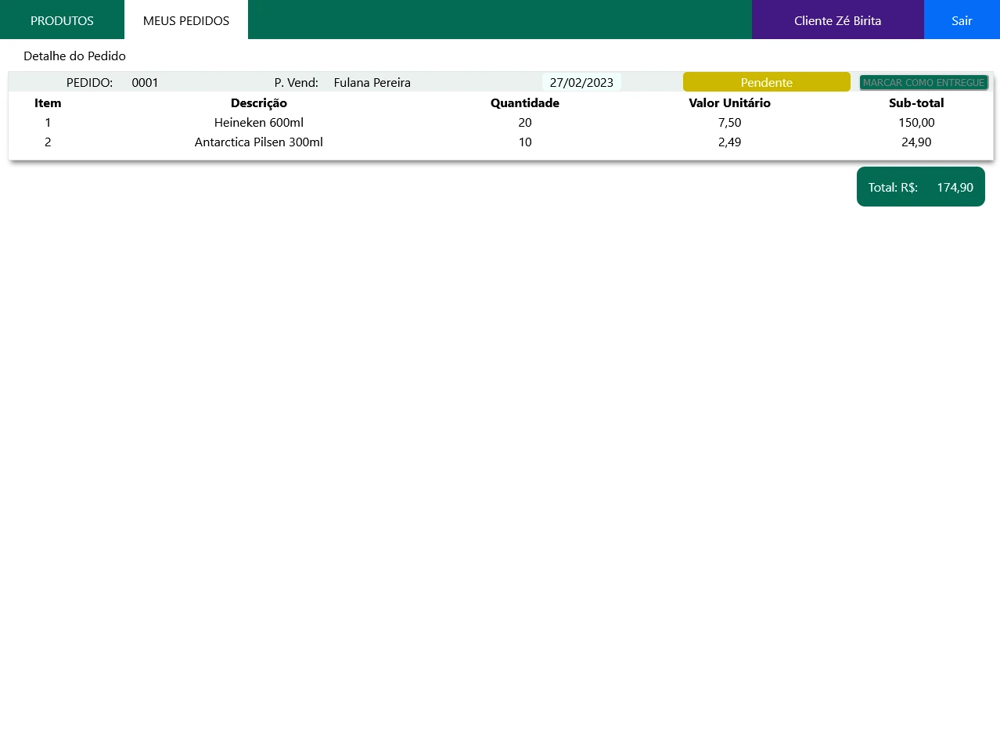
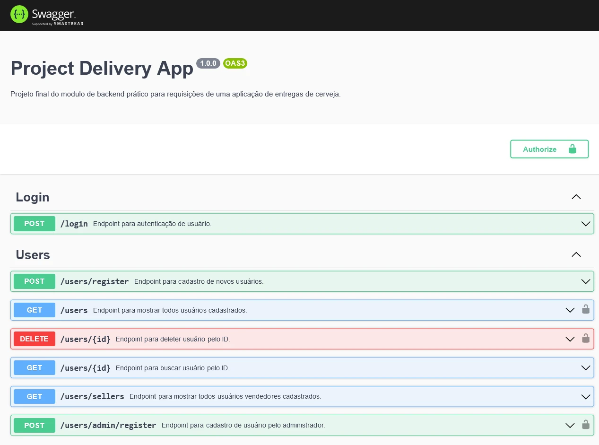
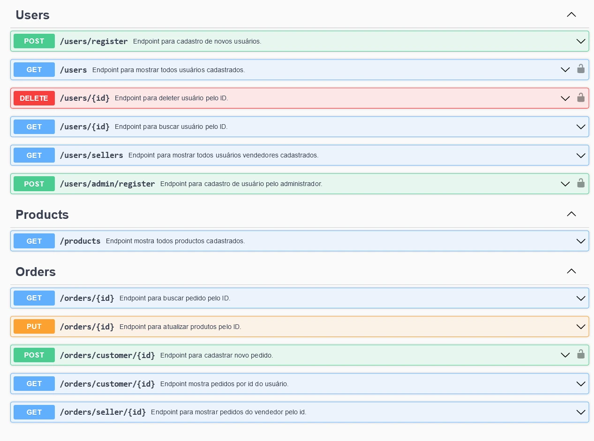
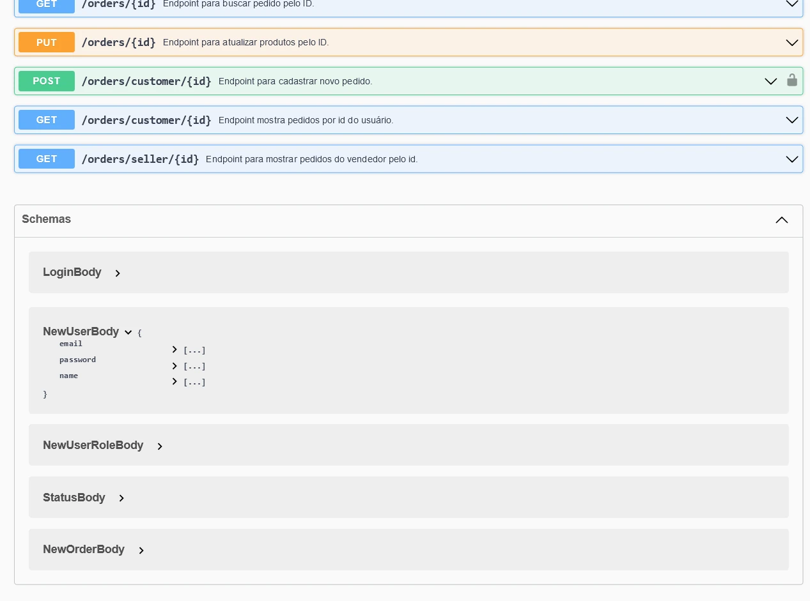

# Sobre

## Seção: `Metodologias Ágeis`

- Seção dedica total ao projeto em grupo, para consolidar as prática em grupo com softskills e hardskills, usando todo conhecimento adiquirido ao longo de todo o curso.

#

  
  
  

>*Amostra do frontend*

  
  
  

>*Amostra da documentação do backend*

#
## Projeto: `Delivery App`

- Aplicação de gerenciamento de compras, vendas e entrega, onde uma pessoa com o papel de 1. Cliente, pode realizar um cadastro pessoal, e realizar compra de bebidas que está disponiveis pela aplicação, abrindo um pedido, fornecendo endereço e concluindo o pedido de compra para realizar rastreio de andamento de entrega do pedido.
2. Vendedor, pode visualizar os pedidos realizado por seus clientes, e movimentar o andamento de cada pedido e seu estado de entrega.
3. Administrador, pode criar ou apagar usuário e determinar suas funções.

# Tecnologias e ferramentas usadas 🛠

# Desafios

- Atender especificações realizadas pelos testes automatizados da trybe;
- Organizar o código e arquitetura geral da aplicação;
- Padronização REST na API;
- Integração entre frontend e backend

# Conclusão

- Foi o projeto que eu mais estava ancioso para iniciar, onde coloquei em prática todo conhecimento absorvido na trybe, e em grupo, onde conheci pessoas que assim como eu queria práticar e entender o funcionamento onde o frontend se comunicava com o backend.
- Abordamos reuniões diárias e divisão de tarefas durante o projeto todo, onde tentamos espor o que fizemos durante o dia anterior, se havia algum problema impedindo a resolução de algo e o que estamos planejando realizar na sequencia.
- Foi muito gratificante e desafiador o desenvolvimento dessa aplicação, como havia focado totalmente no backend, muitas funcionalidades do frontend haviam se perdido, mas foi muito bom ver que com apenas alguns minutos de pesquisa, rápidamente recuperava o que era necessário e aplicava de forma efetiva, muito obrigado pela [Gabriela](https://www.linkedin.com/in/gabrielapapin) por sempre estar presente, a gente participou diariamente juntos o desenvolvendo ao longo do projeto, e também a [Andressa](https://www.linkedin.com/in/andressa-ponzo) mesmo com sua agenda apertada, ela sempre estava ajudando e realizou uma apresentação incrível no final do projeto!

  

    <strong>
      :newspaper_roll: Requisitos solicitados durante o desenvolvimento do projeto
    </strong>
  

 
### Requisitos
*Nome* | *Avaliação*
--- | :---:
1 - Crie uma tela de login que deve ser acessível pelos endpoints / e /login no navegador | :heavy_check_mark:
2 - Crie os elementos da tela de login com os data-testids disponíveis no protótipo | :heavy_check_mark:
3 - Desenvolva a tela de login de maneira que ela impossibilite o login com dados mal-formatados | :heavy_check_mark:
4 - Desenvolva a tela de login de maneira que ela impossibilite o login com dados válidos, porém inexistentes no banco de dados | :heavy_check_mark:
5 - Desenvolva a tela de login de maneira que ela possibilite fazer o login com dados válidos e existentes no banco de dados | :heavy_check_mark:
6 - Crie uma tela de registro que deve ser acessível via endpoint /register no navegador e pelo botão de registro na tela de login | :heavy_check_mark:
7 - Crie os elementos da tela de registro com os data-testids disponíveis no protótipo | :heavy_check_mark:
8 - Desenvolva a tela de registro de maneira que ela impossibilite o cadastro com dados mal-formatados | :heavy_check_mark:
9 - Desenvolva a tela de registro de maneira que ela possibilite cadastrar com dados válidos | :heavy_check_mark:
10 - Desenvolva a tela de registro de maneira que ela impossibilite o cadastro de um usuário já existente | :heavy_check_mark:
11 - Crie uma tela de produtos do cliente contendo uma barra de navegação - navbar - que servirá também para demais telas das pessoas usuárias | :heavy_check_mark:
12 - Desenvolva a tela de produtos do cliente criando os demais elementos com os data-testids disponíveis no protótipo | :heavy_check_mark:
13 - Desenvolva a tela de produtos do cliente de forma que ela pressuponha dados válidos da pessoa usuária armazenados no localStorage | :heavy_check_mark:
14 - Desenvolva a tela de produtos do cliente de forma que os cards de todos os produtos pré-cadastrados contenham os valores corretos | :heavy_check_mark:
15 - Desenvolva a tela de produtos do cliente de forma que o preço total esteja correto após a adição de itens aleatórios | :heavy_check_mark:
16 - Desenvolva a tela de produtos do cliente de forma que haja um botão de carrinho que redirecionará para a tela de checkout caso itens sejam adicionados | :heavy_check_mark:
17 - Crie uma tela de checkout do cliente com elementos com os data-testids disponíveis no protótipo | :heavy_check_mark:
18 - Desenvolva a tela de checkout do cliente de forma a possuir os dados corretos do carrinho e preço total | :heavy_check_mark:
19 - Desenvolva a tela de checkout do cliente de forma que seja possível remover itens do carrinho | :heavy_check_mark:
20 - Desenvolva a tela de checkout do cliente de forma a nos redirecionar para a tela de detalhes do pedido feito após a finalização do mesmo | :heavy_check_mark:
21 - Desenvolva a tela de checkout do cliente de forma a gerar uma nova venda na tabela sales, assim como relações em salesProducts ao finalizar o pedido | :heavy_check_mark:
22 - Crie uma tela de pedidos do cliente com elementos a partir dos data-testids disponíveis no protótipo | :heavy_check_mark:
23 - Desenvolva a tela de pedidos do cliente de forma a conter a lista de pedidos do mesmo com os dados corretos | :heavy_check_mark:
24 - Desenvolva a tela de pedidos do cliente de forma a dar acesso à tela de detalhes de um pedido ao clicar no card do mesmo | :heavy_check_mark:
25 - Crie uma tela de detalhes do pedido do cliente com elementos a partir dos data-testids disponíveis no protótipo | :heavy_check_mark:
26 - Desenvolva a tela de detalhes do pedido do cliente de forma a possuir os dados corretos da venda | :heavy_check_mark:
27 - Crie uma tela de pedidos da pessoa vendedora com elementos a partir dos data-testids disponíveis no protótipo | :heavy_check_mark:
28 - Desenvolva a tela de pedidos da pessoa vendedora de forma a conter a lista de pedidos do mesmo com os dados corretos | :heavy_check_mark:
29 - Desenvolva a tela de pedidos da pessoa vendedora de forma a dar acesso à tela de detalhes de um pedido ao clicar no card do mesmo | :heavy_check_mark:
30 - Crie uma tela de detalhes do pedido da pessoa vendedora com elementos a partir dos data-testids disponíveis no protótipo | :heavy_check_mark:
31 - Desenvolva a tela de detalhes do pedido da pessoa vendedora de forma a possuir os dados corretos da venda | :heavy_check_mark:
32 - Desenvolva a tela de detalhes do pedido da pessoa vendedora de forma a ser capaz de alterar o status do pedido | :heavy_check_mark:
33 - Garanta que o status do pedido atualizado na tela de detalhes do pedido da pessoa vendedora seja refletido na tela de detalhes do pedido do cliente após atualização das páginas | :heavy_check_mark:
34 - Garanta que o status do pedido atualizado na tela de detalhes do pedido da pessoa vendedora seja refletido na tela de lista de pedidos do cliente após atualização das páginas | :heavy_check_mark:
35 - Garanta que o status do pedido atualizado na tela de detalhes do pedido do cliente seja refletido na tela de lista de pedidos da pessoa vendedora após atualização das páginas | :heavy_check_mark:
36 - Crie uma tela de pessoa administradora com elementos a partir dos data-testids disponíveis no protótipo | :heavy_check_mark:
37 - Desenvolva a tela da pessoa administradora de forma a validar o formulário de cadastro | :heavy_check_mark:
38 - Desenvolva a tela da pessoa administradora de forma que seja possível cadastrar pessoas usuárias válidas | :heavy_check_mark:
39 - Desenvolva a tela da pessoa administradora de forma que ela impossibilite o cadastro de pessoas usuárias já existentes | :heavy_check_mark:
40 - Desenvolva a tela da pessoa administradora de forma que haja uma tabela de pessoas usuárias cadastradas | :heavy_check_mark:
41 - Desenvolva a tela da pessoa administradora de forma que seja possível deletar pessoas usuárias na tabela | :heavy_check_mark:

  

    <strong>
      :memo: Todo list
    </strong>
  

  - [x] - ~~Criar aplicação com base nos requisitos da trybe.~~ 

#
## Membros:

  <a href="https://www.linkedin.com/in/andressa-ponzo">
    
  <a href="https://www.linkedin.com/in/davidrogger/">
    
  <a href="https://www.linkedin.com/in/gabrielapapin">
    

#

  

